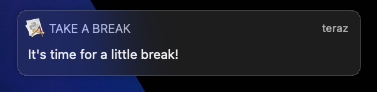
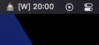
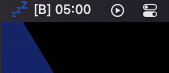

<h1 align='center'>Take a break!</h1>
<p align='center'>
    <b>Take a break</b> is a macOS menu bar application for reducing eye strain and to avoid RSI.
</p>





## Features
- Counting remaining time of work (<b>25 mins</b>) and break (<b>5 mins</b>)
- Notifications to take a break
- Automatic timer restart after system wakes up from hibernation

## Technologies & Libraries
- Python 3.9
- rumps

## Custom setup
By default, work time is set to 25 mins, break to 5 mins and system wakes check interval to 1 min.
<br>
Fell free to set your own values in config.INI file.

## Installing dependencies
To install dependencies to perform test run or build the app type:
<br>
```bash
pip3 install -r requirements.txt
```


## Test run
To run the app without building just type:
<br>
```bash
python3 application.py
```

## Custom build
To produce macOS application type:
<br>
```bash
pip3 install py2app
python3 application_setup.py py2app
```
It will create the app in dist/ directory.
